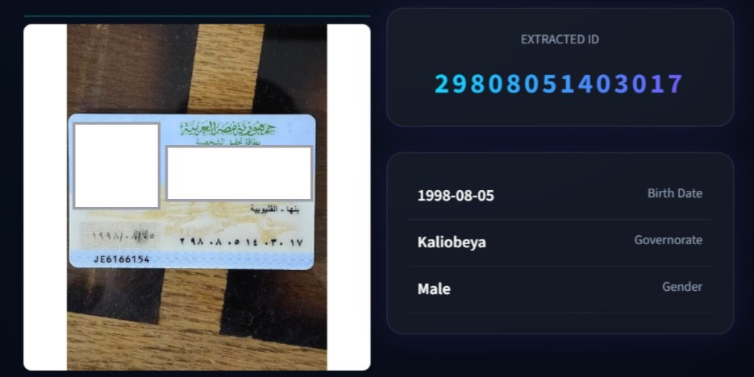

# 🪪 Egyptian National ID Extractor

Computer Vision system that detects, corrects, and extracts structured information from Egyptian National ID cards using YOLOv8, OCR, and image processing techniques.

---

## 🌟 Key Features

- **Automatic Card Detection**  
  Detects and crops the ID card from complex backgrounds using a YOLOv8 object detection model.

- **Smart Orientation Correction**  
  Automatically identifies and fixes card rotation (0°, 90°, 180°, 270°) using confidence-based evaluation.

- **Skew Correction**  
  Uses Hough Line Transform to straighten tilted images and improve OCR accuracy.

- **Hybrid OCR Engine**  
  Combines YOLOv8 digit detection with EasyOCR for robust extraction of the 14-digit National ID.

- **ID Decoding System**  
  Extracts structured information from the ID:
  - Birth Date
  - Governorate
  - Gender

- **Modern Web Interface**  
  Interactive and responsive Streamlit dashboard with a clean dark UI.

---
## 📁 Project Structure

```text
├── app.py              # Streamlit web app
├── utils.py            # All Program Extract_NID_From_Image
├── info.py             # ID decoding and validation logic
├── Models/             # YOLOv8 trained weights
├── requirements.txt    # Python dependencies
├── packages.txt        # System dependencies (for Deployment)
└── README.md
```
---
## ✨Test App:-

<p align="center"></p>

---
## 📸Try It Yourself!
You can test the system with your own ID images (Front side) through our live demo:

👉 Live Demo: https://egyptian-id-extractor-hayoma.streamlit.app/

---

## 🧠 System Architecture

The pipeline follows a multi-stage processing workflow:

1. **Card Detection** → YOLOv8 model detects ID card region  
2. **Preprocessing** → CLAHE, grayscale conversion, and adaptive thresholding  
3. **Orientation Correction** → Selects best rotation using model confidence  
4. **Skew Correction** → Hough Line Transform-based alignment  
5. **Digit Recognition** → YOLOv8 digit model + EasyOCR fallback  
6. **Validation & Decoding** → Ensures valid 14-digit structure and extracts metadata  

---
## 📊 Evaluation

The system was evaluated on a manually collected dataset of 500 Egyptian National ID card images with diverse variations in lighting, rotation, blur, and background conditions.
The model achieved an overall **accuracy of 98%**, demonstrating strong robustness and reliability in real-world scenarios.

---

## 💻 Installation & Setup

### 1️⃣ Clone the Repository

```bash
git clone https://github.com/Hayam-mostafa/Egyptian-NID-Extractor.git
cd Egyptian-NID-Extractor
````

---

### 2️⃣ Install Dependencies

Make sure Python 3.9+ is installed.

```bash
pip install -r requirements.txt
```

### 3️⃣ Run the Application

```bash
streamlit run app.py
```
---


## ⚙️ Technologies Used

* Python 
* YOLOv8 (Ultralytics) 
* OpenCV 
* EasyOCR 
* NumPy
* Streamlit 
